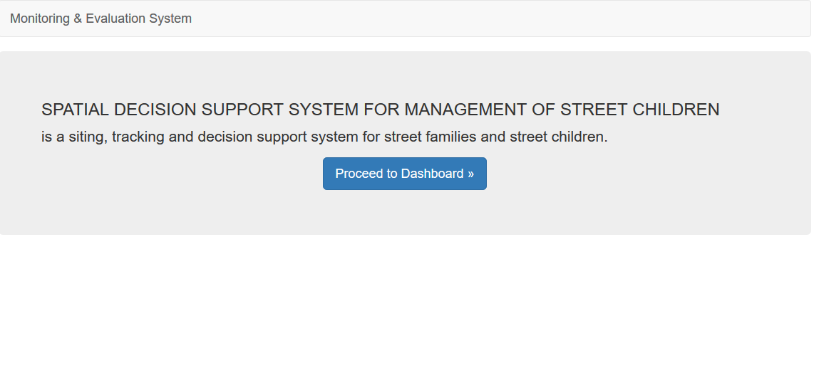
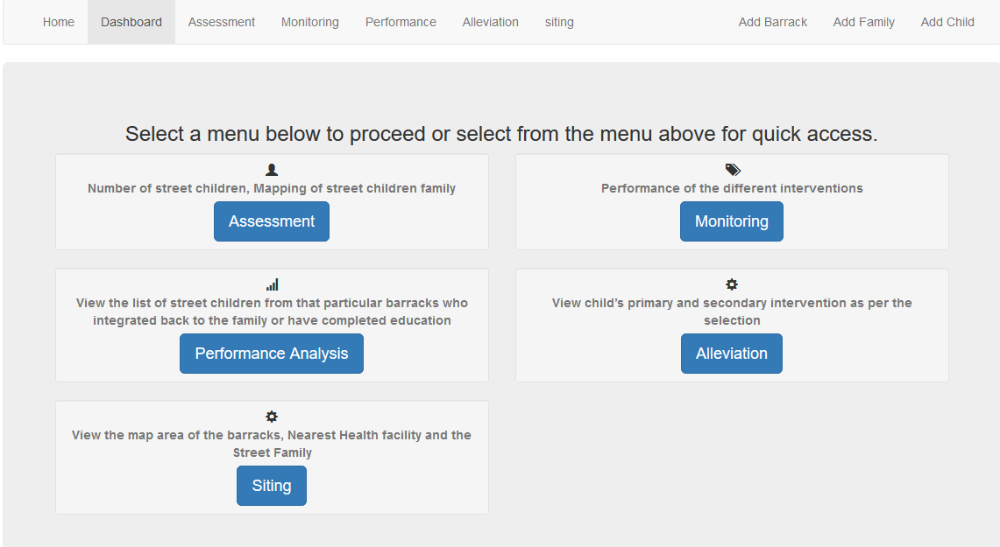
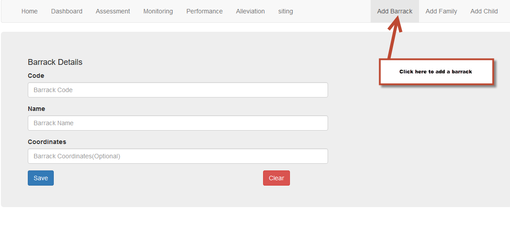
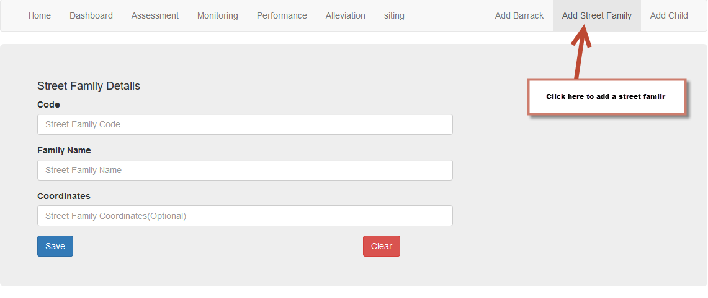
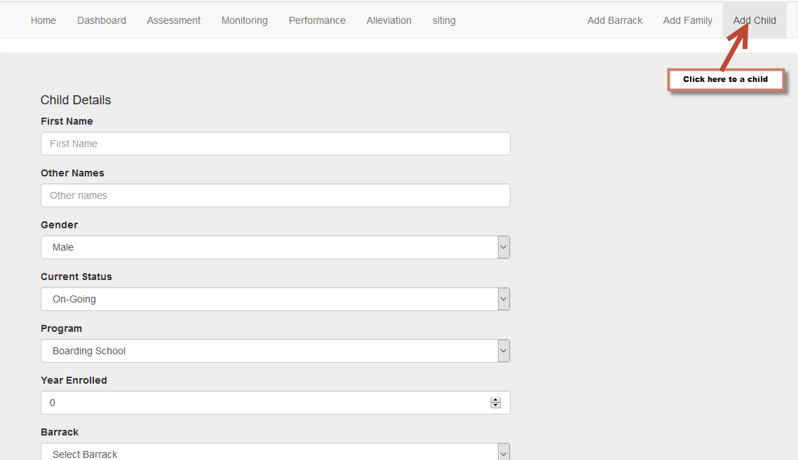
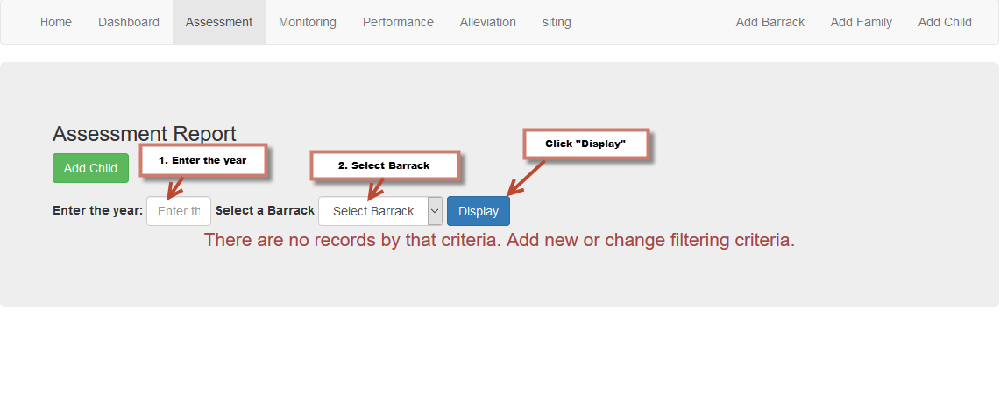

## SPATIAL DECISION SUPPORT SYSTEM
### Welcome Page

### Dashboard (Main Menu)

### Setup
#### Adding a barrack

#### Adding a family

#### Adding a child

### Assessment Module
This screen displays a report on the number of street children, the year they got enrolled, the barracks they are in and their gender.  

### Performance Module
This screen displays the list of Street Children who got integrated back to family, those who have completed education. It also displays a graph representation of the same.  
### Monitoring Module
This screen displays the report on the barracks info in regards to the street children that are there, the year they were enrolled in the barracks, whether they are attending boarding,    primary or on lunch program (depending on the radio button selections.  
### Alleviation Module  
This screen displays the specific name of the street child keyed in, the barracks he/she is enrolled in, year, whether she/he is in boarding school, primary school or lunch program and the reason for being on the street.  
### Siting Module
This screen displays the location of the Barracks, and street family on a map	 

